# 缺陷与测试任务流转

## 总览

```mermaid
flowchart TB
  subgraph lane1 [条线1 本期交付]
    TPull["测试：拉取并开始【测试】"]
    Manual["按计划执行测试并记录证据"]
    FileBug["独立/测试用例发起缺陷 · 验证者=当前用户 · 负责人=开发"]
    DevFix["开发 Skill：已修复 / 暂不修复"]
    Retest["测试：拉取待验"]
    Close["逐Bug复测证据回读后批量关闭"]
    Reopen["复现 → 再次打开"]
    DoneT["缺陷闭环且风险获批 →【测试】已完成、需求测试完成"]
    Release["输出发布候选交接"]
    TPull --> Manual --> FileBug
    FileBug --> DevFix --> Retest
    Retest -->|通过| Close --> DoneT --> Release
    Retest -->|复现| Reopen --> DevFix
  end

  subgraph lane2 [条线2 非本期]
    Adhoc["发起缺陷(非本期) · 负责人自指定"]
    Dev2["开发修复并标已修复/暂不修复"]
    Retest2["测试拉取待验"]
    Close2["逐Bug复测证据回读后批量关闭"]
    Sprint["已关闭并入当期迭代"]
    Adhoc --> Dev2 --> Retest2 --> Close2 --> Sprint
  end
```



## 缺陷状态机（测试可写部分加粗）

01_ONEOS 实网（2026-07-27）：

```text
待确认(28) ──开发──► 处理中(100010) / 已修复(29) / 暂不修复(31) / 已关闭
再次打开(30) ──开发──► 处理中 / 已修复 / 暂不修复

已修复 ──逐Bug复测证据写入并回读──► 【已关闭】(100085) ──► 可并入当期迭代
   │
   └──测试复现──► 【再次打开】(30)

暂不修复(31) ──仅在有明确批准人和批准证据时计入闭环条件
已关闭 ──可再次打开──► 再次打开
```

缺陷统一用 **待确认**；勿写「待处理」指缺陷（「待处理」仅用于【测试】等任务）。

| 状态迁移 | 角色 | 本 Skill |
|---|---|---|
| → 处理中 / 已修复 / 暂不修复 | 开发 | 不做 |
| 已修复 → 已关闭 | 测试 | `批量关闭已修复`；每条Bug必须先回读自己的`oneos.bug-retest/v1` |
| 已修复 → 再次打开 | 测试 | `再次打开` |
| 任意 → 新建缺陷（默认待确认） | 测试 | `发起缺陷` / `从测试用例发起缺陷` / `发起缺陷(非本期)` |

## 【测试】任务闭环

共同条件：

1. 工作项为标题前缀 `【测试】` 的任务（或项目约定的测试任务类型）。
2. 不存在 `待确认` / `处理中` / `已修复` / `再次打开` 等活动缺陷。集合来源为与【测试】**ASSOCIATED** 的缺陷（双向；兼容旧 PARENT 残留）。
3. 【测试】正式`TASK_SUB→【交付】`且`ASSOCIATED→需求`；需求当前为`测试中`；父【交付】已绑定同端有效迭代。

标题分流：

- 含`【新增】`：即使同时含`【优化】`，仍走完整证据。官方CLI回读TestHub计划总数大于0且未执行/失败/阻塞均为0；每条`已关闭`有独立复测通过记录，每条`暂不修复`有批准人和批准证据。
- 仅含`【优化】`：官方CLI回读测试任务评论区最新评论为明确测试通过；只要求活动缺陷为0，不要求TestHub、已关闭Bug复测证据或暂不修复批准。
- 两类均无：拒绝自动闭环。

满足后：`完成测试`将【测试】`处理中→已完成`、需求`测试中→测试完成`，并回读两侧最终状态。

**唯一常规写入口**：`scripts/yunxiao_cli_test_lifecycle.py complete ...`（【新增】须加`--test-plan-id`；【优化】由脚本回读评论；先预检，确认后加`--apply`）。
**禁止**浏览器点「已完成」。

`scripts/close_test_task.py`已停用并始终拒绝写入，防止绕过正式关系、TestHub结果或逐Bug复测门禁。

批量关闭成功后，Agent **应检测**是否已满足闭环条件；满足则在回报中提示并可询问是否立即闭环（需再确认 Plan 或同轮已批准则执行）。

## 负责人 / 验证者规则

| 场景 | 验证者 | 负责人 |
|---|---|---|
| 本期独立创建 | 当前登录测试用户（不可覆盖） | 同交付【开发】负责人；多人 Plan 点选 |
| 本期测试用例创建 | 当前登录测试用户（不可覆盖） | 同交付【开发】负责人；多人 Plan 点选 |
| 非本期 | 当前登录测试用户（不可覆盖） | 口令必填 |
| 再次打开 | 不改 | 不改 |

建单时两条本期路径统一调用`create_bug.py`。脚本不接收验证者参数；apply 后从云效刚创建的 Bug 读取当前会话用户，写入`workitem.verifier`并回读一致性。开发修复不得重写该字段。

解析「同交付【开发】」：

1. 若有 `测试任务=` → 取 PARENT/TASK_SUB 上的【交付】。
2. 列出该交付 `PARENT_SUB` / `TASK_SUB` 下标题含 `【开发】` 的任务。
3. 取唯一负责人；多个则 Plan 点选。

## 并入迭代

- 仅 `已关闭`。
- 迭代必须已存在（产品 `创建迭代`）；本 Skill 只 `propertyKey=sprint` COVER。
- 「当期」= 项目下名称匹配默认前缀且状态进行中的最新一条；歧义则 Plan 点选。

## 与上下游 Skill

| Skill | 职责 |
|---|---|
| YunxiaoPM | 需求/交付/分析/设计/创建迭代；**不建【测试】** |
| yunxiao-development-delivery | 建【开发】、提测建【测试】、缺陷→已修复\|暂不修复 |
| **YunxiaoQA（本 Skill）** | 开始测试、记录证据、提缺陷、回归闭环、推进需求测试完成、交接发布 |
