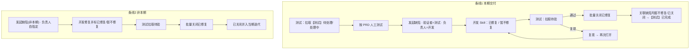

# 缺陷与测试任务流转

## 总览



## 缺陷状态机（测试可写部分加粗）

01_ONEOS 实网（2026-07-27）：

```text
待确认(28) ──开发──► 处理中(100010) / 已修复(29) / 暂不修复(31) / 已关闭
再次打开(30) ──开发──► 处理中 / 已修复 / 暂不修复

已修复 ──测试回归通过──► 【已关闭】(100085) ──► 可并入当期迭代
   │
   └──测试复现──► 【再次打开】(30)

暂不修复(31) ──计入【测试】闭环条件（不必再关）
已关闭 ──可再次打开──► 再次打开
```

缺陷统一用 **待确认**；勿写「待处理」指缺陷（「待处理」仅用于【测试】等任务）。

| 状态迁移 | 角色 | 本 Skill |
|---|---|---|
| → 处理中 / 已修复 / 暂不修复 | 开发 | 不做 |
| 已修复 → 已关闭 | 测试 | `批量关闭已修复` |
| 已修复 → 再次打开 | 测试 | `再次打开` |
| 任意 → 新建缺陷（默认待确认） | 测试 | `发起缺陷` / `发起缺陷(非本期)` |

## 【测试】任务闭环

条件（全部满足）：

1. 工作项为标题前缀 `【测试】` 的任务（或项目约定的测试任务类型）。
2. 与之正式关联的缺陷集合中，**每一条**状态 ∈ {`暂不修复`, `已关闭`}。
3. 不存在 `待确认` / `处理中` / `已修复` / `再次打开` 等未闭环缺陷。

满足后：`闭环测试任务` 将【测试】标为 `已完成`。

批量关闭成功后，Agent **应检测**是否已满足闭环条件；满足则在回报中提示并可询问是否立即闭环（需再确认 Plan 或同轮已批准则执行）。

## 负责人 / 验证者规则

| 场景 | 验证者 | 负责人 |
|---|---|---|
| 本期（绑测试/交付） | 当前测试人 | 同交付【开发】负责人；多人 Plan 点选 |
| 非本期 | 当前测试人（可覆盖） | 口令必填 |
| 再次打开 | 不改 | 不改 |

解析「同交付【开发】」：

1. 若有 `测试任务=` → 取 PARENT/TASK_SUB 上的【交付】。
2. 列出该交付 `PARENT_SUB` / `TASK_SUB` 下标题含 `【开发】` 的任务。
3. 取唯一负责人；多个则 Plan 点选。

## 并入迭代

- 仅 `已关闭`。
- 迭代必须已存在（产品 `创建迭代`）；本 Skill 只 `propertyKey=sprint` COVER。
- 「当期」= 项目下名称匹配默认前缀且状态进行中的最新一条；歧义则 Plan 点选。

## 与上下游 Skill

| Skill | 职责 |
|---|---|
| YunxiaoPM | 需求/交付/分析/设计/创建迭代；**不建【测试】** |
| YunxiaoDev（未来） | 建【开发】、提测建【测试】、缺陷→已修复\|暂不修复 |
| **YunxiaoQA（本 Skill）** | 测试拉单、提缺陷、关闭/再次打开、并入迭代、闭环【测试】 |
